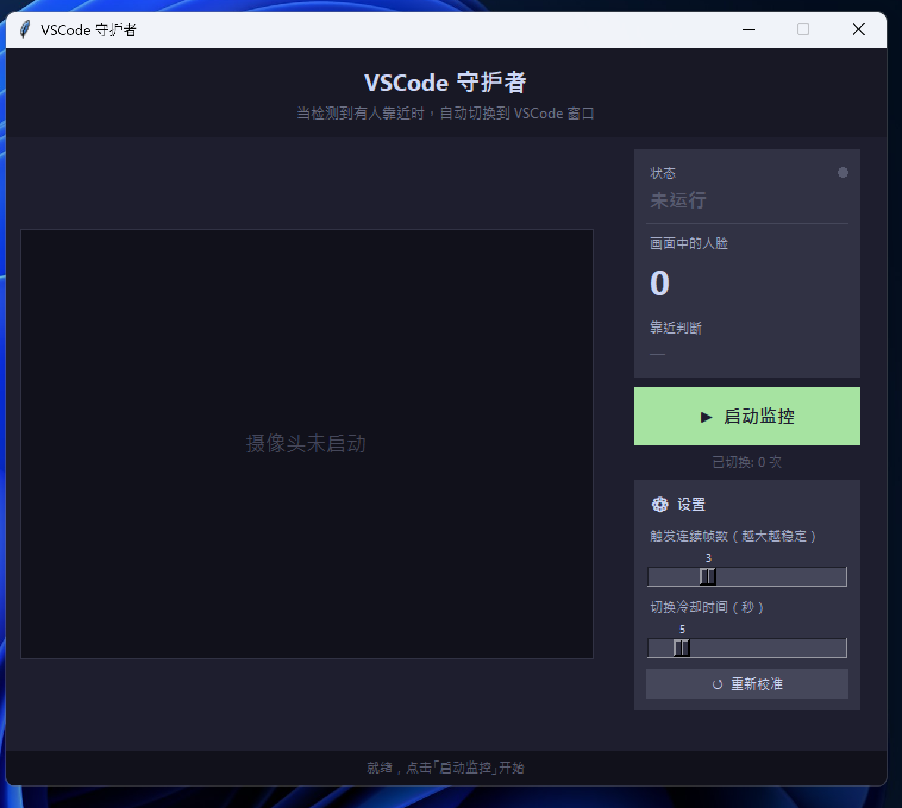

# VSCode 守护者 (vscode-guard)

> **当有人靠近时，自动将 VSCode 切换到前台** —— 让老板/同学看到你在"认真写代码"。



---

## 功能特性

- 🎥 **实时摄像头监控** — 利用 OpenCV Haar 级联分类器进行人脸检测，每隔若干帧采样一次，兼顾精度与性能
- 🧠 **自动基准校准** — 启动后自动采集 20 帧建立基准人脸数，有效排除"用户本人"的干扰
- ⚡ **智能触发** — 连续超基准帧数达到阈值才触发切换，避免误报
- 🔔 **柔和报警提示** — 检测到陌生人时播放纯 Python 生成的叮咚提示音（无需音频文件）
- 🪟 **强制前台切换** — 通过 Win32 API 绕过 Windows 焦点限制，将 VSCode 窗口可靠地提到最前
- ⚙️ **可调参数** — 支持实时调整触发连续帧数（灵敏度）与切换冷却时间
- 🔄 **一键重新校准** — 环境或人员变化时可随时重置基准

---

## 界面预览

| 区域 | 说明 |
|------|------|
| 左侧画布 | 摄像头实时画面，检测到的人脸用绿色框标出 |
| 右上状态卡 | 当前运行状态、画面中人脸数、是否有人靠近 |
| 右中按钮 | 启动 / 停止监控，显示累计切换次数 |
| 右下设置卡 | 触发连续帧数、切换冷却时间、重新校准 |
| 底部日志栏 | 带时间戳的最新操作日志 |

---

## 环境要求

- **操作系统**：Windows 10 / 11（依赖 `win32api` / `winsound`，仅限 Windows）
- **Python**：3.10 及以上
- **摄像头**：任意 USB 或内置摄像头

---

## 快速开始

### 1. 安装依赖

双击运行 `install.bat`，或手动执行：

```bash
pip install -r requirements.txt
```

依赖包：

| 包 | 版本要求 | 用途 |
|----|---------|------|
| `opencv-python` | ≥ 4.8.0 | 摄像头读取与人脸检测 |
| `pillow` | ≥ 10.0.0 | 将 OpenCV 帧转为 Tkinter 可显示的图像 |
| `pywin32` | ≥ 306 | 操作 Windows 窗口（前台切换） |

### 2. 启动程序

双击运行 `run.bat`，或手动执行：

```bash
python vscode_guard.py
```

### 3. 使用流程

1. 点击 **「▶ 启动监控」** 按钮
2. 保持坐在摄像头前静止约 **2–3 秒**，程序完成基准校准
3. 校准完成后，状态变为 **「监控中」**（绿色）
4. 当有陌生人进入画面时，程序自动播放提示音并将 VSCode 切换到前台
5. 需要调整灵敏度或冷却时间时，直接拖动设置面板中的滑块即可
6. 环境或人员变化时，点击 **「↺ 重新校准」** 重置基准

---

## 参数说明

| 参数 | 默认值 | 说明 |
|------|--------|------|
| 触发连续帧数 | 3 | 需要连续多少帧超过基准才触发切换，值越大越稳定，值越小越灵敏 |
| 切换冷却时间 | 5 秒 | 两次切换之间的最小间隔，防止频繁切换 |
| 检测间隔 | 每 3 帧 | 代码内置常量 `DETECT_INTERVAL`，降低 CPU 占用 |
| 基准校准帧数 | 20 帧 | 代码内置常量 `CALIBRATION_TOTAL`，用于计算基准人脸数 |

---

## 注意事项

- 程序需要访问系统摄像头，请在杀毒软件 / 隐私设置中允许 Python 使用摄像头
- 弱光环境下检测精度会下降，建议保持正常室内照明
- 若找不到 VSCode 窗口，日志栏会提示"未找到 VSCode 窗口"，请确认 VSCode 已打开
- 本工具仅支持 Windows，不支持 macOS / Linux

---

## 文件结构

```
vscode-guard/
├── vscode_guard.py     # 主程序
├── requirements.txt    # Python 依赖
├── install.bat         # 一键安装脚本
├── run.bat             # 一键启动脚本
└── docs/
    └── images/         # 截图等文档图片
```

---

## License

MIT
